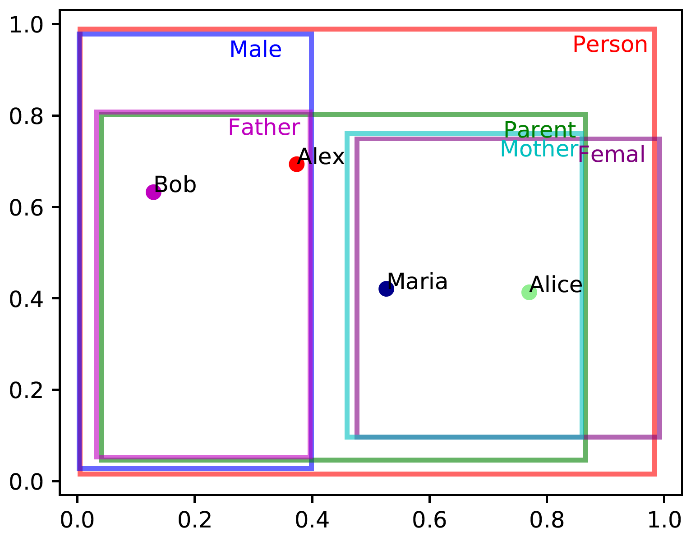

# Faithful embeddings for EL++ Knowledge Bases

This is the official pytorch implementation of paper **Faithful embeddings for EL++ Knowledge Bases**. The code was implemented based on [el-embeddings](https://github.com/bio-ontology-research-group/el-embeddings).

# Requiriments

You need CUDA installed to use a GPU, and need to install python libraries with:
```
pip install -r requirements.txt
```

# Data

We have preprocessed all the data in /data directory. In particular, we have normalized the ontologies into normal forms and splited the data into train/valid/test sets.

For original data, refer https://bio2vec.cbrc.kaust.edu.sa/data/elembeddings/el-embeddings-data.zip for protein-protein interaction
and https://github.com/kracr/EmELpp for subsumption reasoning. 


## Toy example


To run our family domain example, simply open
```
./notebooks/ToyFamily.ipynb
```
or use our Google colab https://colab.research.google.com/drive/17U5olNtQotVXFT9kfr2p9K8RM_x2qH40?usp=sharing

You could get the the following results



## Subsumption reasoning and PPI

e.g., to reproduce the results on Gene Ontology, simply run
```
python scripts/BoxEL-GO.py 
```

## Citation

If you find this code useful, please cite the following paper: 
```
@inproceedings{Xiong2022Faithful,
  title={Faithful embeddings for EL++ Knowledge Bases},
  author={Bo Xiong and Nico Potyka and Trung-Kien Tran and Mojtaba Nayyeri and Steffen Staab},
  booktitle={International Semantic Web Conference},
  year={2022}
}
```
